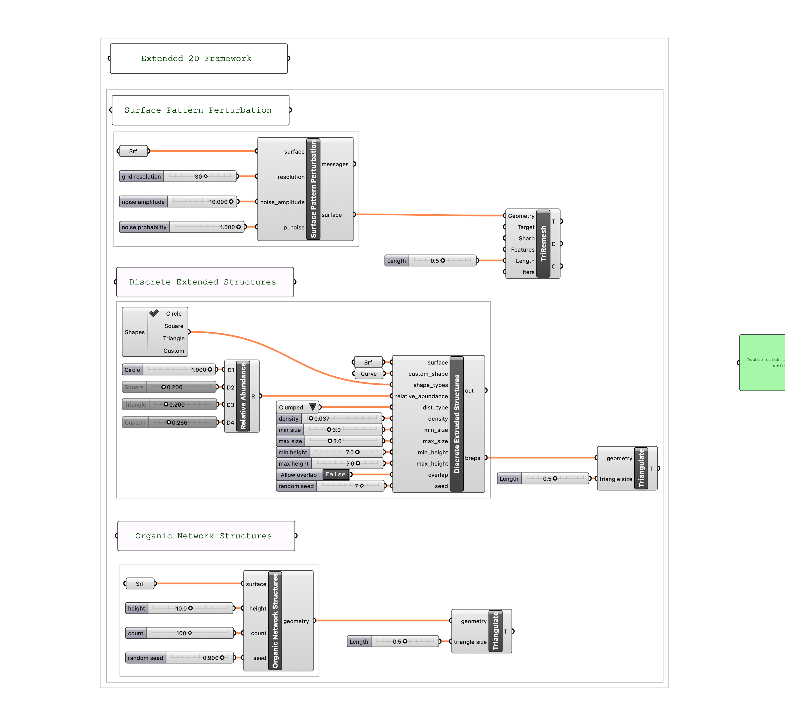
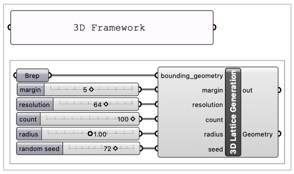
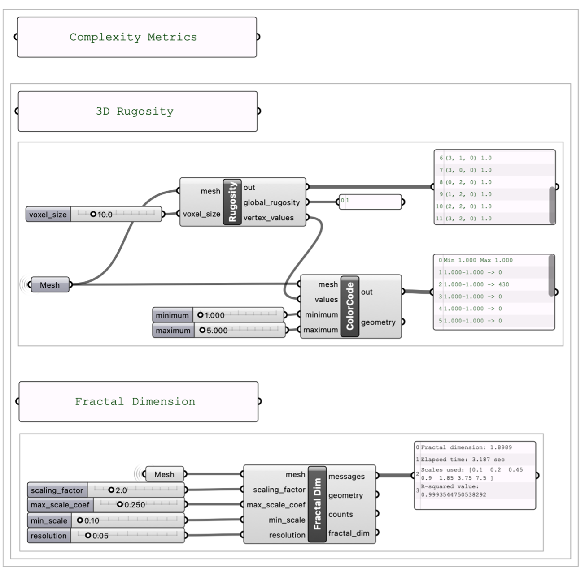

# SPACE
### Scalable Parametric Architecture for Complexity Enhancement

SPACE is a parametric modelling framework for the systematic generation and control of habitat complexity in coastal structure design.

## Quick Start
Requires Rhino 8. Download from https://www.rhino3d.com/download/

Download the .gh file from this repository and open with Rhino 8.

## Extended Two-dimensional Framework
The extended two-dimensional framework generates structures through vertical extrusion of parametrically defined surface patterns.  

The framework consists of three independent modules:
1.	Surface pattern perturbation
2.	Discrete extruded structures
3.	Continuous network structures



To start, create a simple surface along the XY plane and select as the ```Srf``` input. You can toggle the parameters to explore the range of generated structures.

## Three-dimensional framework

The three-dimensional framework only consists of one module, the 3D Lattice Generation module.



To start, create a simple box and set it as the ```Brep``` input. Toggle the parameters to explore the range of generated structures.

## Complexity Metrics
SPACE provides voxel-based Rugosity and Fractal Dimension calculations.



Each module produces a Rhino Mesh object that can be used as the ```Mesh``` input.  

##
Author: Low Xi Si

This framework is developed as part of my NUS Final Year Project, under the guidance of A/P Peter Todd, and A/P Stylianos Dritsas.
